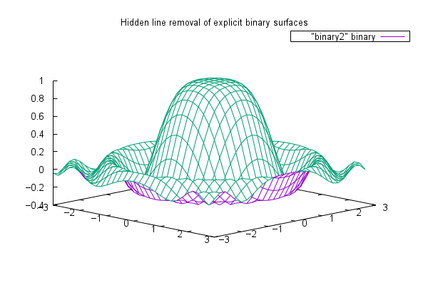

## 交叉引用 {#sec:crossref}

PanBook 使用 [pandoc-crossref](http://lierdakil.github.io/pandoc-crossref/) 处理交叉引用。

### 图片

```
{#fig:label}
```

要标记（隐式）图形，请在图像定义之后立即附加 `{#fig:label}`（其中 `label` 需要是一个独一无二的字符串标记）。

这只适用于隐式图形，即在段落中单独出现的图像（将由 pandoc 呈现为带有标题的图形）

图像块和标签不能用空格分开。

#### 子图
结合`fenced_divs`语法，可以将图片分组为子图片。基本语法如下（效果见 [@fig:figureRef]）：

```markdown
::: {#fig:figureRef}
{#fig:figureRefA}

{#fig:figureRefB}

Caption of figure
:::
```

::: {#fig:figureRef}
{#fig:figureRefA width=40%}

{#fig:figureRefB width=40%}

Caption of figure
:::

综上所述，子图由一个具有图片 id 的 div 构成。该 div 的内容由几个段落组成。除最后一段外，所有段落都包含一个子图，并带有标题、图像和（可选的）引用属性。最后一段包含图片标题。

如果在段落中放置多个图片，那么仍然会呈现这些图形，但是 Pandoc 会在大多数输出中省略子图形标题（但是在 \LaTeX 中它会像预期的那样工作）。您可以使用特定于输出的技巧来解决这个问题，或者使用 `subfigGrid`（见下文）。

输出是可定制的，使用元数据字段。有关更多信息，请参见 [Customization](http://lierdakil.github.io/pandoc-crossref/#customization)。

默认设置将从上面的例子中产生以下等价的标记：

```markdown
<div id="fig:figureRef" class="subfigures">

{#fig:figureRefA}

{#fig:figureRefB}

Figure 1: Caption of figure. a — subfigure 1 caption, b — subfigure 2
caption

</div>
```

对子图的引用将呈现为 figureNumber (subfigureNumber)，例如，在这个特定的例子中，`[@fig:figureRefA]` 将生成 [@fig:figureRefA]。

可以将 `notitle` 样式添加到图片中，以完全抑制子图标题。注意，抑制的子图仍然会被计数。

#### 子图网格

如果需要对网格中的子图进行对齐，并且不能使用输出格式样式，则可以使用 subfigGrid 选项。此选项将用表格中组织子图。

不同的段落作为表格的行，段落内的子图作为表格的列。

列宽度将从相应图像的宽度属性中提取，例如（效果见 [@fig:coolFig]）：

```markdown
::: {#fig:coolFig}
{#fig:cfa width=40%}
{#fig:cfb width=40%}

{#fig:cfb width=40%}
{#fig:cfb width=40%}

Cool figure!
:::
```

::: {#fig:coolFig}
{#fig:cfa width=40%}
{#fig:cfb width=40%}

{#fig:cfb width=40%}
{#fig:cfb width=40%}

Cool figure!
:::

将产生列宽度为 `40%` 和 `40%` 的子图网格。

表格宽度计算只考虑图像的第一行，其他行完全忽略。

除了图像之外的任何元素都会被静默地忽略。因此，任何文本、空格、软换行符等都将静默地从输出中消失。当然，这不适用于图片标题段落。

所有图像将自动设置宽度属性为 `100%`，以便填充整个列。

在除 `%` 之外的任何地方指定宽度都会引发错误。

如果未指定第一行中某些图像的宽度，则这些图像将在剩余空间中均匀地展开。

如果没有为第一行中的任何图像指定宽度，那么这些图像将平均占用页面宽度的 99%（因为 Pandoc 忽略了表的宽度属性）。

在 LaTeX 输出中忽略这个选项，但是段落断行应该产生类似的效果，所以图像应该正确地排版。您不需要启用 subfigGrid 就可以使用 LaTeX，但是您仍然可以启用它。

### 公式

```
$$ math $$ {#eq:label}
```

To label a display equation, append `{#eq:label}` (with label being something unique to reference this equation by) immediately after math block.

Math block and label can be separated by one or more spaces.

You can also number all display equations with `autoEqnLabels` metadata setting (see below). Note, however, that you won’t be able to reference equations without explicit labels.

Equations numbers will be typeset inside math with `\qquad` before them. If you want to use tables instead, use tableEqns option. Depending on output format, tables might work better or worse than `\qquad`.

### 表格

```
a   b   c
--- --- ---
1   2   3
4   5   6

: Caption {#tbl:label}
```

To label a table, append `{#tbl:label}` at the end of `table` caption (with label being something unique to reference this table by). Caption and label must be separated by at least one space.

### 标题

You can also reference sections of any level. Section labels use native pandoc syntax, but must start with “sec:”, e.g.

```
Section {#sec:section}
```

### 代码块

There are a couple options to add code block labels. Those work only if code block id starts with lst:, e.g. `{#lst:label}`

#### caption attribute
caption attribute will be treated as code block caption. If code block has both id and caption attributes, it will be treated as numbered code block.

~~~
```{#lst:code .haskell caption="Listing caption"}
main :: IO ()
main = putStrLn "Hello World!"
```
~~~

### 引用

```
[@fig:label1;@fig:label2;...] or [@eq:label1;@eq:label2;...] or [@tbl:label1;@tbl:label2;...] or @fig:label or @eq:label or @tbl:label
```

Reference syntax heavily relies on citation syntax. Basic reference is created by writing @, then basically desired label with prefix. It is also possible to reference a group of objects, by putting them into brackets with ; as separator. Similar objects will be grouped in order of them appearing in citation brackets, and sequential reference numbers will be shortened, e.g. 1,2,3 will be shortened to 1-3.

You can capitalize first reference character to get capitalized prefix, e.g. `[@Fig:label1]` will produce Fig. ... by default. Capitalized prefixes are derived automatically by capitalizing first letter of every word in non-capitalized prefix, unless overridden with metadata settings. See Customization for more information.

#### Linking references
To make references into hyperlinks to referenced element, enable `linkReferences` metadata option. This has no effect on LaTeX output, since in this case, hyperlinking references is handled with `hyperref` LaTeX package.

#### Custom prefix per-reference
It’s possible to provide your own prefix per-reference, f.ex. `[Prefix @reference]` will replace default prefix (`fig./sec./`etc) with prefix verbatim, e.g. `[Prefix @fig:1]` will be rendered as Prefix 1 instead of fig. 1.

In citation group, citations with the same prefix will be grouped. So, for example `[A @fig:1; A @fig:2; B @fig:3]` will turn into A 1, 2, B 3. It can be used to an advantage, although it’s a bit more cumbersome than it should be, e.g. `[Appendices @sec:A1; Appendices @sec:A2; Appendices @sec:A3]` will turn into Appendices `@A1-@A3` (with @A1 and `@A3` being relevant section numbers). Note that non-contiguous sequences of identical prefixes will not be grouped.

**Not supported with cleveref LaTeX output.**

#### Prefix suppression
Prepending - before @, like so `[-@citation]`, will suppress default prefix, e.g. `[-@fig:1]`will produce just 1 (or whatever number it happens to be) without fig. prefix.

In citation group, citations with and without prefixes will be in different groups. So `[-@fig:1; @fig:2; -@fig:3]` will be rendered as 1, fig. 2, 3, so be careful with this feature. Again, non-contiguous sequences are not grouped together.

#### Lists
It’s possible to use raw latex commands `\listoffigures`, `\listoftables` and `\listoflistings`, which will produce ordered list of figure/table/listings titles, in order of appearance in document.

`\listoflistings` depends on other options, and is defined in preamble, so it will work reliably only with standalone/pdf output.

NOTE: With Pandoc 2.0.6 and up, you’ll have to explicitly separate these commands if they are close together, at least when targeting something besides LaTeX. So this will not work:

```
\listoffigures

\listoftables

\listoflistings
```

but this will:
```
\listoffigures
[]: hack to split raw blocks
\listoftables
[]: hack to split raw blocks
\listoflistings
```

### 自定义交叉引用配置

使用选项 `--crs`指定自定义的交叉引用配置，默认为`crs/zh-CN.yaml`。配置方法请参考`pandoc-crossref`文档：https://lierdakil.github.io/pandoc-crossref